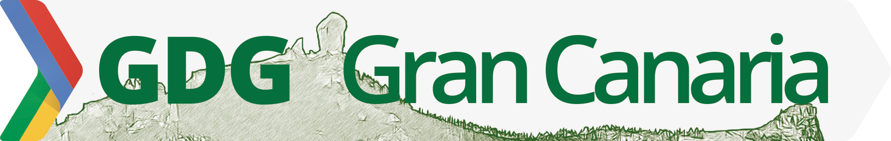

    <h1>Codecraft</h1>
    
El arte de aprender a programar

    

        
    

    

        

            Codecraft es un proyecto para enseñar a programar a niños de entre 7 y 16 años de edad. Consta de 3 sesiones de 3 horas cada una en donde de manera iterativa e incremental, vamos abordando conceptos relacionados con la programación, la instalación de servidores y los lenguajes de programación.
        

        
<a class="btn btn-primary btn-lg" href="//j.mp/1RdjFWG" role="button">Apuntarse</a>
        

    

    

        <i class="fa fa-file-code-o fa-5x"></i>
        <h4>Aprende a programar</h4>
        

            Programar es una actividad tremendamente entretenida que ayuda, entre otras cosas, a mejorar tu capacidad para resolver problemas, pensar de manera analítica, aplicar un poco de lógica en la resolución de tus tareas y entender como funcionan los dispositivos y aplicaciones que nos rodean.
        

    

    

        <i class="fa fa-lightbulb-o fa-5x"></i>
        <h4>Mantente creativo</h4>
        
            
            No existe una única manera de solucionar un problema, programar es un trabajo altamente creativo y ¿Quien más creativo que los niños?. Nuestra forma de enseñar a los niños a programar se basa en la idea de que al igual en el proceso de lecto-escritura, los niños deben primero aprender a leer código antes que a escribirlo.
        

    

    

        <i class="fa fa-gamepad fa-5x"></i>
        <h4>Hazlo divertido</h4>
        

            Aprender jugando es una de las técnicas más efectivas que hay para interiorizar los conceptos. En Codecraft el principal objetivo es pasárselo bien, por eso hemos escogido Minecraft como plataforma de soporte, sabemos que a todos los niños les gusta.
        

    

    
    <h1 class="text-center">Organizan</h1>
    

        </a>
    

    

        </a>
    

    

        </a>
    

